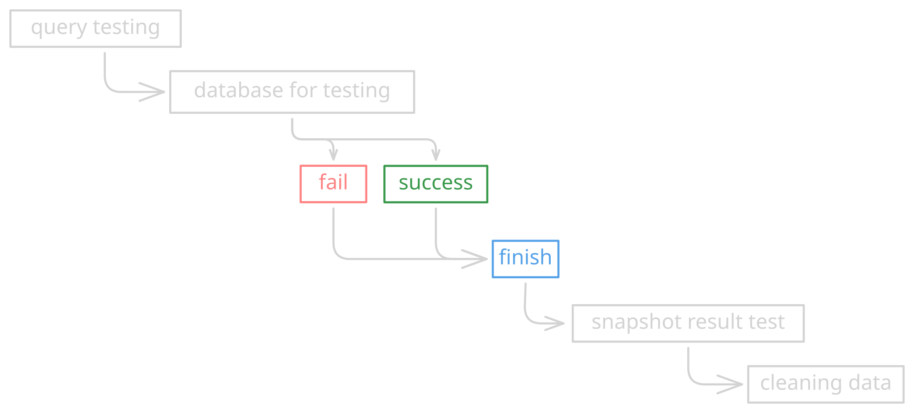

# Two-Database PostgreSQL Architecture

## Background

In this project, I implemented the concept of **two separate PostgreSQL databases**: one used by the Java application and another dedicated exclusively to Java testing.

I found it difficult to test queries reliably when using in-memory databases such as **H2** or **SQLite**. The main reasons are:

- **SQL dialect differences.** PostgreSQL-specific features such as `BIGSERIAL`, `TIMESTAMPTZ`, `jsonb`, `RETURNING`, `ON CONFLICT`, CTEs, and others are not fully supported by H2 or SQLite. As a result, the same queries may need to be rewritten differently.
- **Data type handling differences.** Column definitions, defaults, and casting behavior are not identical, which can lead to misleading test results: a test may pass on H2 but fail on PostgreSQL in production.
- **Constraint and schema behavior differences.** Features such as `search_path`, indexes, and transaction behavior do not work exactly the same way.

For these reasons, I want **both the application and tests to run against real PostgreSQL instances**, but in **isolated environments** so that test data never contaminates development data, and vice versa.

## Design Decisions

Two PostgreSQL instances with **identical schemas** are used. Both are initialized using the same `schema-init.sh` script and `schema/migrations/*.sql` files, ensuring that queries written in tests can run unchanged in the application.

| Aspect | App Instance | Test Instance |
|---|---|---|
| Compose file | `src/main/docker/docker-compose.yaml` | `src/main/docker/docker-compose.yaml` |
| Project | `bracket` | `bracket-test` |
| Container | `bracket-db` | `bracket-test-db` |
| Host port | `5432` | `5433` |
| Database | `bracket` | `bracket_test` |
| Non-public schema | `bracket` | `bracket` |
| Volume | `bracket_database` | `bracket-test_database-test` |
| Network | `bracket-net` | `bracket-test-net` |
| Used by | `make dev` / `make start` / `make start-prod` | `make test` (`%test` profile) |

> The key concept: **two instances, one schema source.** Since `schema/script/schema-init.sh` and all `schema/migrations/*.sql` files are mounted into both instances, the application and tests always use the same table structure.

## Architecture (Compose Topology)


## Testing Flow



Since the `%test` profile points to `localhost:5433/bracket_test` with `bracket` as the default schema, `@QuarkusTest` does not need to start the development database. CI environments without Docker can also boot the application thanks to the tolerant connection pool configuration.

## Trade-offs and Resource Requirements

**Disclaimer:** This is still an experimental approach based on my own reasoning, and I plan to try implementing it in this project.

- **Increased resource consumption.** Running two PostgreSQL containers means two database processes running simultaneously, resulting in higher local memory and CPU usage than a single database—or an in-process database such as H2. This is a trade-off I am willing to accept in exchange for consistent query behavior.
- **Isolation in return.** Development and test data remain separate, and `make docker-test-refresh` can reset the test schema without affecting development data.

## How to Run

```bash
# App (dev): start the application database, then enable hot reload
make docker-up
make dev

# Test: isolated test database on port 5433
make docker-test-up        # Run once when getting started
make docker-test-cli       # Inspect \dn / \dt and execute queries directly
make test                  # Run tests against bracket_test
make docker-test-refresh   # Re-run migrations from scratch (wipes the test volume)
```